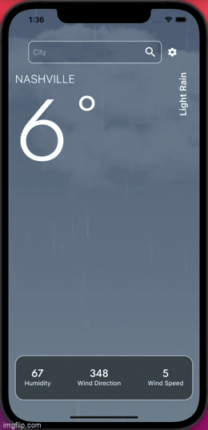

<h1 align="center">Welcome to cloudwatch 👋</h1>
<p>
  <a href="https://github.com/qevka/cloudwatch#readme" target="_blank">
    
  </a>
  <a href="https://github.com/qevka/cloudwatch/graphs/commit-activity" target="_blank">
    
  </a>
  <a href="https://github.com/qevka/cloudwatch/blob/master/LICENSE" target="_blank">
    
  </a>
</p>

> 
> 
> 
> This is a simple app that queries the metaweather api and displays weather data from around the world.
> 
## Core Features
>   * Getx State Management (dependency injection / MVC).
>   * Ability to change Temperature Units (Celsius/Fahrenheit).
>   * Particle Animators for different weather conditions.
>   * Data models that include all of MetaWeather's data points for possibility of future feature development.
>   * Separate Settings screen for future settings and cleaner design.
>   * Settings persist after app is closed.
> 
## Potential Improvements
>   * Auto-Completing textfield (when someone types a city it shows a list of citys that match what they have typed so far) like google maps.
>   * The Metaweather api doesn't include all the cities in the US or world just a small subset. If we continued using this API we could make a function that would return the lat and lon for specific cities, then we could query the api using lat and lon which then would return the id for the nearest city. Having a way to get the (woeid) for the nearest available city would be helpful.
>   * The ability to see a whole weeks forcast instead of just the current weather.
>   * Ability to persist different locations or a home location so that the user doesn't have to keep to keep entering their city in over and over again.

## How to run the App
>   1. Clone the repo to a local directory on your PC or Mac
>   2. Open the App in Android Studio, VSCode, or XCode (if opening in xcode be sure to open the /cloudwatch/ios/Runner.xcworkspace file).
> Running the App
>   3a. Android Studio - click the play button on the top of the IDE (make sure you have a simulator selected).
>   3b. XCode - Open the IDE and click the play button at the top of the window
>   3c. VSCODE/Terminal - open a terminal window and type the following commands

## open a simulator

```sh
open -a simulator
```

> From the root directory of the the project run the following command in terminal.

```sh
Flutter run
```

> If you have a real device plugged in and want to build on that device and be able to unplug from your PC or Mac after use the following --release flag.

```sh
Flutter run --release
```

### 🏠 [Homepage](https://github.com/qevka/cloudwatch#readme)

## Install

```sh
flutter run --release
```

## Run tests

```sh
flutter test
```

## Author

👤 **Caleb Maccarone**

* Github: [@qevka](https://github.com/qevka)
* LinkedIn: [@maccarone](https://linkedin.com/in/maccarone)

## 🤝 Contributing

Contributions, issues and feature requests are welcome!<br />Feel free to check [issues page](https://github.com/qevka/cloudwatch/issues).

## Show your support

Give a ⭐️ if this project helped you!

## 📝 License

Copyright © 2022 [Caleb Maccarone](https://github.com/qevka).<br />
This project is [ISC](https://github.com/qevka/cloudwatch/blob/master/LICENSE) licensed.

***